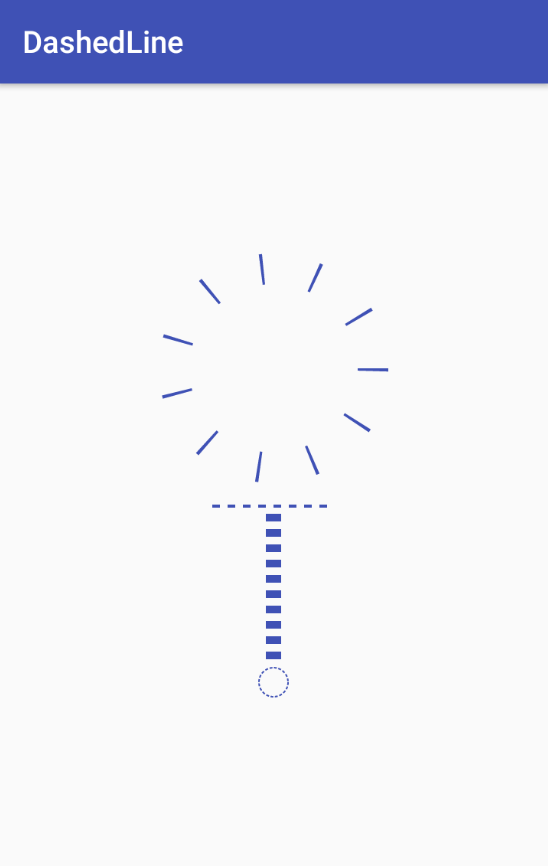

# DashedLine

## 前言
一般情况下, 我们在布局绘制实线和虚线, 可以使用shape来作为View的背景来实现. <br/>

* 实线

```
<shape xmlns:android="http://schemas.android.com/apk/res/android"
       android:shape="line">
    <stroke
        android:width="3dp"
        android:color="@color/colorPrimary"/>
</shape>
```

* 虚线

```
<shape xmlns:android="http://schemas.android.com/apk/res/android"
       android:shape="line">
    <stroke
        android:width="3dp"
        android:color="@color/colorPrimary"
        android:dashGap="3dp"
        android:dashWidth="5dp"/>
</shape>
```

这个方法绘制实线的时候是没问题的, 但是在绘制虚线时, 很可能无法绘制成功.
因为使用shape绘制虚线需要开启硬件加速.
当然, 有些人觉得那就开启硬件加速呗, 但是开启硬件加速是有利有弊的, 在没有必要开启的时候, 我们完全可以尝试另外的方法, 那就是自定义View.<br/>
<br/>
本项目就是在上诉的情况下建立的, 当然, 不仅仅于绘制直虚线, 还有绘制圆形虚线的控件, 以及后续可能继续开发的具有更多使用实用效果的虚线控件.

## 效果
绘制直线虚线和圆形虚线的效果如下:

<br/>

XML代码:

```
<LinearLayout
    xmlns:android="http://schemas.android.com/apk/res/android"
    xmlns:app="http://schemas.android.com/apk/res-auto"
    android:id="@+id/activity_main"
    android:layout_width="match_parent"
    android:layout_height="match_parent"
    android:gravity="center"
    android:orientation="vertical">

    <com.linsh.dashedline.DashedCircleLine
        android:layout_width="150dp"
        android:layout_height="150dp"
        android:layout_gravity="center"
        app:dashColor="@color/colorPrimary"
        app:dashGap="35dp"
        app:dashWidth="2dp"
        app:strokeWidth="20dp"/>

    <com.linsh.dashedline.DashedLine
        android:layout_width="80dp"
        android:layout_height="10dp"
        android:layout_marginTop="10dp"
        app:dashColor="@color/colorPrimary"
        app:dashGap="5dp"
        app:dashOrientation="horizontal"
        app:dashWidth="5dp"
        app:strokeWidth="2dp"/>

    <com.linsh.dashedline.DashedLine
        android:layout_width="10dp"
        android:layout_height="100dp"
        app:dashColor="@color/colorPrimary"
        app:dashGap="5dp"
        app:dashOrientation="vertical"
        app:dashWidth="5dp"/>

    <com.linsh.dashedline.DashedCircleLine
        android:layout_width="20dp"
        android:layout_height="20dp"
        android:layout_gravity="center"
        app:dashColor="@color/colorPrimary"
        app:dashGap="1dp"
        app:dashWidth="2dp"
        app:strokeWidth="1dp"/>

</LinearLayout>
```

## 使用方法

|attr属性          |  说明
|------------------|------
|dashColor         |  虚线颜色
|dashGap           |  虚线间隔
|dashWidth         |  单个虚线长度
|strokeWidth       |  虚线宽度
|dashOrientation   |  虚线方向 (horizontal--横, vertical--竖)
